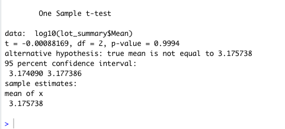
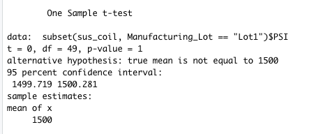
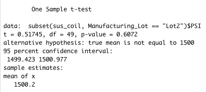
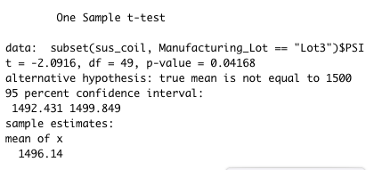

# MechaCar_Statistical_Analysis

## Linear Regression to Predict MPG

### Which variables/coefficients provided a non-random amount of variance to the mpg values in the dataset?
1. Ground Clearance
2. Vehicle Length
3. Intercept

This means the ground clearance and vehicle length have significant impact on mpg.

### Is the slope of the linear model considered to be zero? Why or why not?
It is not considered to be zero. Because the r-squared value is at 0.71, that means about 71% of the variablilty in miles per gallon (mpg) is explained using this linear model. Also, the p-value is 5.35 x 10^11, which is much smaller than the assumed significance level of 0.05%. With these two factors in mind, we can say that there is sufficient evidence to reject our null hypothesis, meaning the slop of our linear model is not zero.

### Does this linear model predict mpg of MechaCar prototypes effectively? Why or why not?
No, it does not. Because the Intercept is statistically significant, this could mean that ground clearance and vehicle length may need to be transformed to better improve this model. Or it could mean that there are other variable not included in this model that could better explain the variability of miles per gallon (mpg).

## Summary Statistics on Suspension Coils
The design specifications for the MechaCar suspension coils dictate that the variance of the suspension coils must not exceed 100 pounds per square inch. Does the current manufacturing data meet this design specification for all manufacturing lots in total and each lot individually? Why or why not?

Looking at Total Summary, technically, yes the variance technically meets manufacturing data and does not exceed 100 PSI. 

Looking at Lot Summary, we can see that the variance of the suspension coils do not exceed 100 PSI in Lot1 and Lot2, however it does exceed 100 variance in Lot3. Therefore, Lot3 may not meet design specifications.

## T-Tests on Suspension Coils
Looking at the t-tests, we are determining if the PSI across all manufacturing lots is statistically different from the population mean of 1,500 PSI.

As you can see, our p-value is 0.999 and above the assumed significance level of 0.05 percent therefore, we do not have sufficient evidence to reject the null hypothesis. The two means are statistically similar. 

### Now let's break down by lot:
#### Lot1

For Lot1, the p-value is 1 and way above our assumed significance level of 0.05 percent. Therefore, we reject the null hypothesis and the PSI of Lot1 is statistically similar to the population mean of 1,500 PSI.

#### Lot2

For Lot2, the p-value is 0.61, which is also above our assumed significance level of 0.05 percent. The PSI of Lot2 is statistically similar to the population mean of 1,500 PSI.

#### Lot3

For Lot3, the p-value is 0.042 and above our assumed significance level of 0.05 percent. The PSI of Lot3 is statistically similar to the population mean of 1,500 PSI.

## Study Design: MechCar vs Competition
Write a short description of a statistical study that can quantify how the MechaCar performs against the competition. In your study design, think critically about what metrics would be of interest to a consumer: for a few examples, cost, city or highway fuel efficiency, horse power, maintenance cost, or safety rating.

### What metric or metrics are you going to test?
In order to quantify how MechaCar performs against the competition, I could comparre multiple different metrics such as horse power, mpg, highway fuel efficiency and cost. 

### What is the null hypothesis or alternative hypothesis?
I want to look at if there is a statistical difference between the distribution means from multiple samples.

Is there any statistical difference in horsepower between MechaCar and the competition based on cost?
Is there any statistical difference in mpg of between MechaCar and the competition based on cost?
Is there any statistical difference in fuel efficiency between MechaCar and the competition based on cost?

### What statistical test would you use to test the hypothesis? And why?
Since I am wanting to look at the means of a continuous numerical variable across various groups, I would test with a one-way Anova test to answer each question I listed above. 

### What data is needed to run the statistical test?
Since I am performing an Anova test and Anova tests have assumptions about the input data, I must have:
1. The dependent variable is numerical and continuous, and the independent variables are categorical.
2. The dependent variable is considered to be normally distributed.
3. The variance among each group should be very similar.

For clarity, the independent variable in this case is cost of vehicle. The dependent variables are horsepower, mpg, and fuel efficiency. I would need to convert the independent variable, cost of vehicle, to a categorical vector in order to perform this statistical test. I would clean the data and convert using factor() in R.
