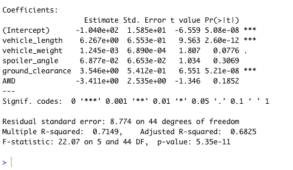

# MechaCar_Statistical_Analysis

## Linear Regression to Predict MPG

### Which variables/coefficients provided a non-random amount of variance to the mpg values in the dataset?
1. Ground Clearance
2. Vehicle Length
3. Intercept

This means the ground clearance and vehicle length have significant impact on mpg.

### Is the slope of the linear model considered to be zero? Why or why not?
It is not considered to be zero. Because the r-squared value is at 0.71, that means about 71% of the variablilty in miles per gallon (mpg) is explained using this linear model. Also, the p-value is 5.35 x 10^11, which is much smaller than the assumed significance level of 0.05%. With these two factors in mind, we can say that there is sufficient evidence to reject our null hypothesis, meaning the slop of our linear model is not zero.

### Does this linear model predict mpg of MechaCar prototypes effectively? Why or why not?
No, it does not. Because the Intercept is statistically significant, this could mean that ground clearance and vehicle length may need to be transformed to better improve this model. Or it could mean that there are other variable not included in this model that could better explain the variability of miles per gallon (mpg).

## Summary Statistics on Suspension Coils
The design specifications for the MechaCar suspension coils dictate that the variance of the suspension coils must not exceed 100 pounds per square inch. Does the current manufacturing data meet this design specification for all manufacturing lots in total and each lot individually? Why or why not?

Looking at Total Summary, technically, yes the variance technically meets manufacturing data and does not exceed 100 PSI. 

Looking at Lot Summary, we can see that the variance of the suspension coils do not exceed 100 PSI in Lot1 and Lot2, however it does exceed 100 variance in Lot3. Therefore, Lot3 may not meet design specifications.
